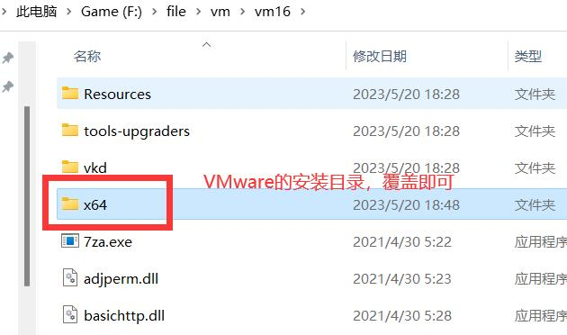
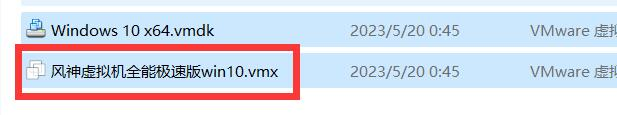

# 一、介绍

虚拟机 (VM) 是一种虚拟环境，我们可以在一台物理计算机上模拟多台虚拟计算机。它运行在其主机的一个隔离分区上，拥有自己的 CPU 能力、内存、操作系统（如 Windows、Linux、macOS）和其他资源。这些虚拟计算机所拥有的功能与我们的物理计算机无异。

而且目前虚拟机版本必须是vmware16.1.2，因为vmware16.1.2是现在公认的最稳定版本，并且大部分去虚拟化和过检测都是在此版本上处理的。

vmware16.1.2 激活密钥 ZF3R0-FHED2-M80TY-8QYGC-NPKYF

vmware16.1.2下载地址：阿里云盘

# 二、为什么？

过游戏检测、逆向破解使用。当脚本与游戏在同一环境下极易被检测到而且大部分检测都是在同一环境下检测的，使用虚拟机可以隔离脚本和游戏，更安全。

# 三、安装vmware

[VMware Workstation 16 Pro](https://blog.csdn.net/wangpaiblog/article/details/112152218)

# 四、使用防检测虚拟镜像

## 1. 替换x64文件

下载地址：阿里云盘（一般找到的防检测虚拟机都会提供x64文件）

找到VM安装目录，下载网页的通用x64文件，覆盖到VM安装目录x64文件夹即可



## 2. 虚拟机系统文件

下载地址：阿里云盘

打开虚拟机系统文件运行，解压后得到以下几个文件，打开vmx后缀的文件，会加载到vmware软件，启动即可



## 3. 验证虚拟机

下载地址：阿里云盘

使用飞秋软件把 虚拟机检测文件 传入虚拟机中进行验证

# 五、vm去虚拟化

去虚拟化 加代码 过vmp 打显卡上游戏

反检测原理:

```
该工具的原理是通过驱动注入，逆向屏蔽vm检测指令。这是一个具有用户模式界面的 Windows 驱动程序，用于隐藏 Windows 计算机上的特定环境，例如已安装的 RCE 程序（例如 procmon、wireshark）、vmware相关特征

特征

屏蔽注册表项和值

屏蔽文件和目录

屏蔽进程（实验性的，可能不稳定）

保护特定进程

从屏蔽和保护功能中排除特定进程

驱动级的程序的用户模式接口（lib 和 cli）

等等
```

---

> 版权声明©：
>
> 本文为 CHA.ATY 的原创文章，遵循 [CC BY-NC-SA 4.0](https://creativecommons.org/licenses/by-sa/4.0/) 许可证进行授权，转载请附上原文出处链接及本声明。
>
> 作者：CHA.ATY
>
> 邮箱：2165150141@qq.com