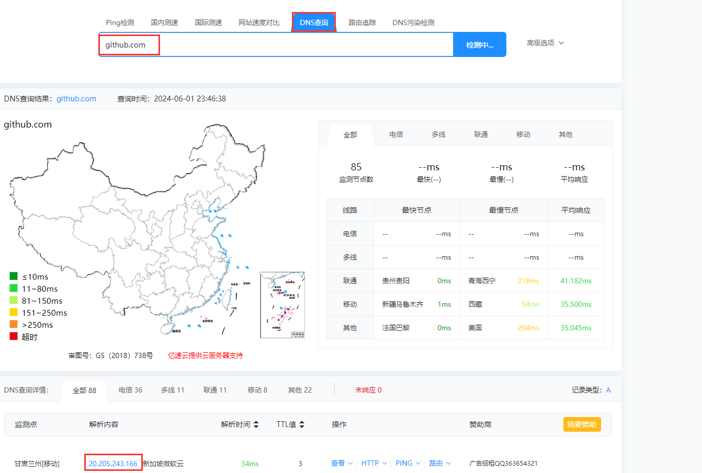
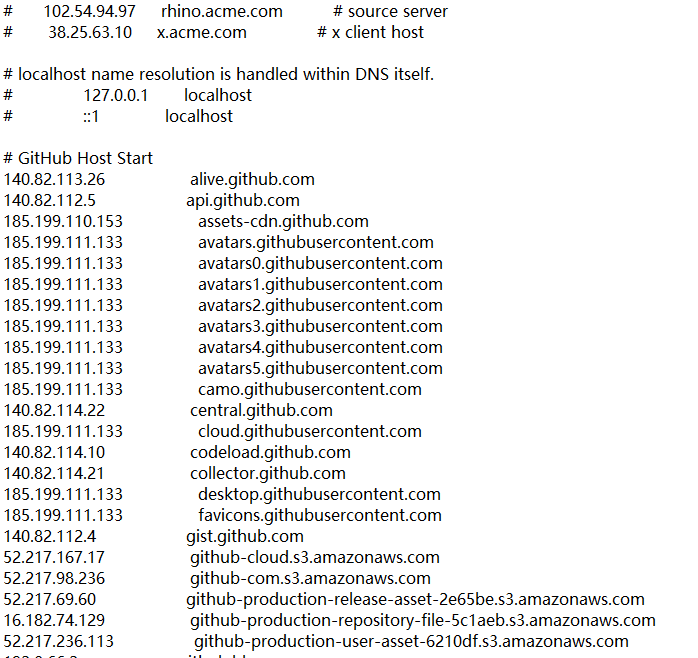

#

# 一、Github 访问慢的原因

GitHub 在全球各地都有服务器，而国内 DNS 解析服务器基本上都是把域名解析到了美国的服务器，所以访问会慢。

可以通过修改本地 hosts 文件绕过国内 DNS 解析。

---

# 二、方法一

通过以下网站，直接查询如下网站的 IP 地址，然后修改 hosts 文件

1. https://www.ipaddress.com/
2. http://ping.chinaz.com/
3. https://github.com/521xueweihan/GitHub520



查询内容：

1. github.com
2. assets-cdn.github.com
3. github.global.ssl.fastly.net

<!-- tabs:start -->

#### **Windows HOSTS 文件**

C:/Windows/System32/drivers/etc

更新 dns 缓存（仅 windows 系统需要该步骤），终端输入如下命令：

```bash
ipconfig /flushdns
```

#### **Linux HOSTS 文件**

/etc/hosts

<!-- tabs:end -->



---

# 三、方法二

使用镜像加速网站：

1. kkgithub 镜像：https://kkgithub.com/
   - 使用方法：比如你在访问 GitHub 某个页面：https://github.com/Itfuture-zifeiYu，使用镜像网站加速则替换域名即可： https://kkgithub.com/Itfuture-zifeiYu。
2. githubfast 镜像：https://githubfast.com/
   - 使用方法：比如你在访问 GitHub 某个页面：https://github.com/Itfuture-zifeiYu，使用镜像网站加速则替换域名即可： https://githubfast.com/Itfuture-zifeiYu。
